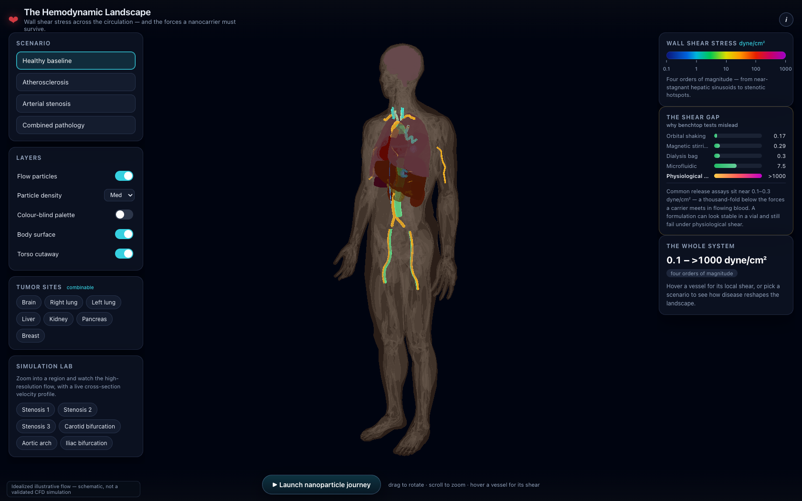

# The Hemodynamic Landscape

[](LICENSE)
[](docs/assets/anatomy/LICENSE)
[](https://threejs.org)
[](https://harsh9005.github.io/shear-stress-3d-viz/)

> **An interactive 3D map of wall shear stress (WSS) across the human circulatory system — and the mechanical forces a circulating nanocarrier must survive.**

A nanomedicine traveling through the bloodstream meets wall shear stress that spans **four orders of magnitude** — from near-stagnant hepatic sinusoids (~0.1 dyne/cm²) to stenotic hotspots (>1000 dyne/cm²). This project turns that landscape into a living, luminous, explorable visualization.

**▶ [Open the live experience](https://harsh9005.github.io/shear-stress-3d-viz/)**


---

## What it does

The vasculature is rendered as WSS-colored tubes inside a **real human body** — a segmented cadaver skin surface, with real brain, lungs, liver, spleen, pancreas, kidneys and a beating anatomical heart, opened by a cutaway over the torso. **24 of the 37 vessel centerlines are extracted from named segmented anatomy**, not drawn by hand. Streaming blood-flow particles run along them. Several interactive layers turn the picture into an explanation:

| | |
|---|---|
| **🩸 Scenario explorer** | Switch between a healthy baseline, atherosclerosis, arterial stenosis, and a combined worst case. Affected vessels re-color, hotspots ignite, and a grounded explanation updates. |
| **🧫 Multi-site tumors** | Toggle tumors on at **seven anatomical sites** (brain, lungs, liver, kidney, pancreas, breast) — combinable, so you can place several at once. Each marks its vasculature as low/oscillatory disturbed flow. |
| **💊 Nanoparticle journey** | Follow a ~100 nm carrier from injection toward its target while a **carrier-integrity gauge** reacts to the real shear forces at each waypoint — margination in low shear, rising membrane permeability, and **burst rupture at the >1000 dyne/cm² stenosis**. |
| **✨ High-resolution flow simulation** | Tens of thousands of GPU particles stream along every vessel with a **parabolic velocity profile** (fast core, slow walls) and **shear-driven margination** (carriers drift to the wall in low shear). Adaptive count holds framerate. |
| **🔬 Simulation lab** | Zoom into any region — a stenosis, a bifurcation, or an active tumor — for a high-resolution local view with a **live cross-section velocity profile** showing the margination skew. |
| **🫀 Real anatomy** | The body, organs and heart are meshes from **BodyParts3D**, fitted to the scene by a transform solved against aortic landmarks. Hover any vessel and the tooltip says whether its course is real anatomy (and which segmented part it came from) or schematic. |
| **📊 Quantitative panels** | A log-scale WSS spectrum, live per-vessel readouts, and **"The Shear Gap"** — the chart that shows why benchtop release assays (~0.1–0.3 dyne/cm²) sit a thousand-fold below physiological flow. |

> The particle physics (parabolic profile + shear-driven margination) is physically-motivated and **illustrative — idealized flow, not a validated CFD simulation** (labeled in-app).

A colorblind-safe palette, keyboard navigation, reduced-motion support, and a touch/mobile layout are built in.





---

## The wall shear stress landscape

Representative WSS magnitudes consistent with the hemodynamics & nanomedicine literature, spanning four decades:

| Region | WSS (dyne/cm²) | Physiological role |
|:---|:---:|:---|
| Hepatic sinusoids · lymphatics | 0.1 – 0.6 | Near-stagnant; fenestrated endothelium allows nanoparticle access |
| Venous circulation | 1 – 6 | Low-pressure, high-capacitance return |
| Atherosclerosis-prone sites | < 4 | Low / oscillatory shear; upregulates VCAM-1 / ICAM-1 |
| Carotid (laminar) arteries | 10 – 20 | Maintains a quiescent, atheroprotective endothelium |
| General arterial | 10 – 70 | Pulsatile systemic circulation |
| Arterioles | ~ 55 | Highest physiological shear |
| Tumor vasculature | low & oscillatory | Disorganized flow + elevated interstitial pressure impair penetration |
| Stenotic hotspots | > 1000 | Extreme stress; can strip hydration shells and rupture soft lipid bilayers |

All values used by the app and the figures come from a single source of truth, `build/build_data.py` → `docs/data/data.json`, and are checked against an explicit allowlist (`build/test_build_data.py`).

---

## Static figures

Publication-style figures, regenerated from the same data:

| Wall shear stress map | The Shear Gap |
|:---:|:---:|
|  |  |

| Disease scenarios | WSS spectrum |
|:---:|:---:|
|  |  |

---

## Run it locally

The interactive app is a no-build, static Three.js site (modules loaded from a pinned CDN), so it needs to be **served over HTTP** — opening `index.html` directly via `file://` won't load ES modules.

```bash
# Serve the app
cd docs
python3 -m http.server 8000
# then open http://localhost:8000/
```

Regenerate the data and the static figures:

```bash
# Rebuild the single source of truth (docs/data/data.{json,js})
python3 build/build_data.py
python3 -m pytest build/        # 28 invariants incl. schema, honesty and anatomy checks

# Rebuild the static figures
pip install -r requirements.txt
python3 figures/generate_static_figures.py
```

---

## How it's built

```
docs/                      # GitHub Pages site (the interactive app)
  index.html               #   shell + pinned Three.js import map
  css/style.css            #   dark glassmorphic UI (responsive, reduced-motion)
  js/                      #   main · anatomy · colorscale · vessels · flow · panels
                           #   · scenarios · tumors · journey · simlab · ui
  data/data.{json,js}      #   generated single source of truth
  assets/anatomy/*.glb     #   real body / organs / heart (CC BY-SA — see its LICENSE)
build/
  build_data.py            # the only place WSS + scenarios + journey + anchors live
  allowed_wss.py           # defensible-value allowlist
  test_build_data.py       # schema + honesty invariants
  test_anatomy_fit.py      # provenance + anchor-integrity + licence guards
  anatomy/                 # offline pipeline; needs trimesh, not needed to run the site
    fetch_source.py        #   download the 547 MB BodyParts3D archive into a gitignored cache
    parts.py               #   curated FMA-id → role map, and what the source does NOT contain
    source.py              #   archive reader; resolves composite parts, prunes debris shells
    fit_transform.py       #   solves the source → scene-frame transform from aortic landmarks
    centerline.py          #   geodesic centerline extraction from tubular surface meshes
    limbs.py               #   limb axes read off the real body, for vessels the source lacks
    build_anatomy.py       #   → docs/assets/anatomy/*.glb + vessels.json
    check_containment.py   #   diagnostic: how much of the tree is inside the body
figures/
  generate_static_figures.py  # matplotlib figures from docs/data/data.json
tools/capture.mjs          # headless-Chrome capture (hero stills / GIF)
```

Rebuilding the anatomy assets is optional — they are committed. To redo it:

```bash
pip install trimesh fast-simplification rtree
python3 build/anatomy/fetch_source.py        # 547 MB, cached and gitignored
python3 build/anatomy/fit_transform.py       # solve + record the coordinate fit
python3 build/anatomy/build_anatomy.py       # meshes + centerlines
python3 build/build_data.py                  # fold them into the single source of truth
```

- **Rendering** — `WebGLRenderer` + a low `UnrealBloomPass` (tuned so the colorscale stays legible against lit tissue), `OrbitControls`, an emissive/Fresnel vessel shader, a separate Fresnel-lit tissue shader, and GPU flow particles.
- **Anatomy** — real meshes are decimated offline and shipped already in scene coordinates, so the browser does no coordinate maths. The body draws front-faces-only and *before* the vessels: transparent draws are not depth-sorted, so skin painted over the interior would tint everything behind it.
- **Provenance is data** — every vessel carries `provenance` (`anatomical` with the source part named, or `schematic`). BodyParts3D segments no limb arteries, no cerebral arteries, no portal or hepatic vein and no lymphatics; those vessels stay authored, are seated inside the real limbs by `limbs.py`, and say so in their tooltip.
- **Single source of truth** — `build_data.py` serializes once to `data.json`, then re-emits it as an ES module `data.js`; the web app imports the module and the figures read the JSON, so no number is written twice.
- **Color scale** — a log mapping (0.1 → 1000 dyne/cm²) owned by `colorscale.js`, with a colorblind-safe cividis alternative.

---

## License

Source code: MIT — see [LICENSE](LICENSE).

**Anatomy assets are under different terms.** `docs/assets/anatomy/*.glb` and
`build/anatomy/vessels.json` are derived from BodyParts3D and are licensed under
**Creative Commons Attribution-Share Alike 2.1 Japan**, which is share-alike:

> BodyParts3D, © The Database Center for Life Science
> licensed under [CC Attribution-Share Alike 2.1 Japan](https://creativecommons.org/licenses/by-sa/2.1/jp/deed.en)

See [docs/assets/anatomy/LICENSE](docs/assets/anatomy/LICENSE) for the notice and for exactly
what was changed.

WSS magnitudes shown here are representative values consistent with the published hemodynamics and nanomedicine literature, provided for visualization and education.
