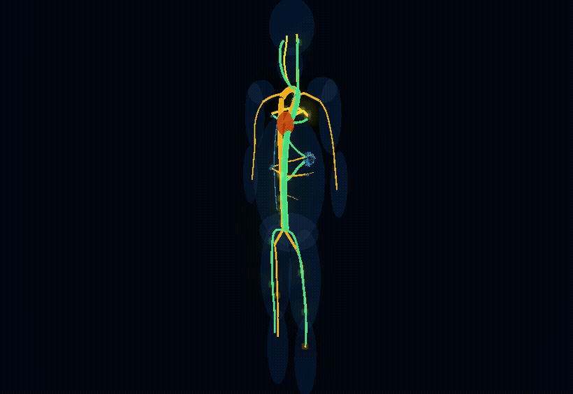
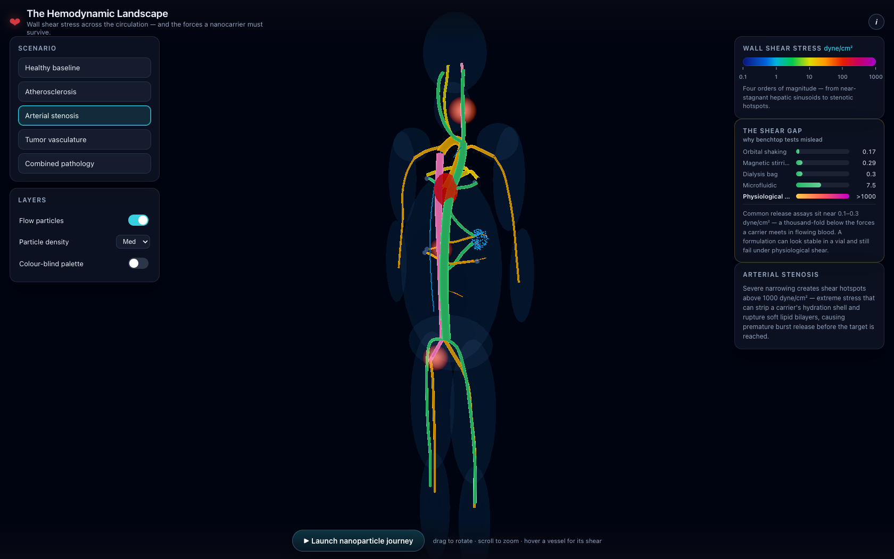
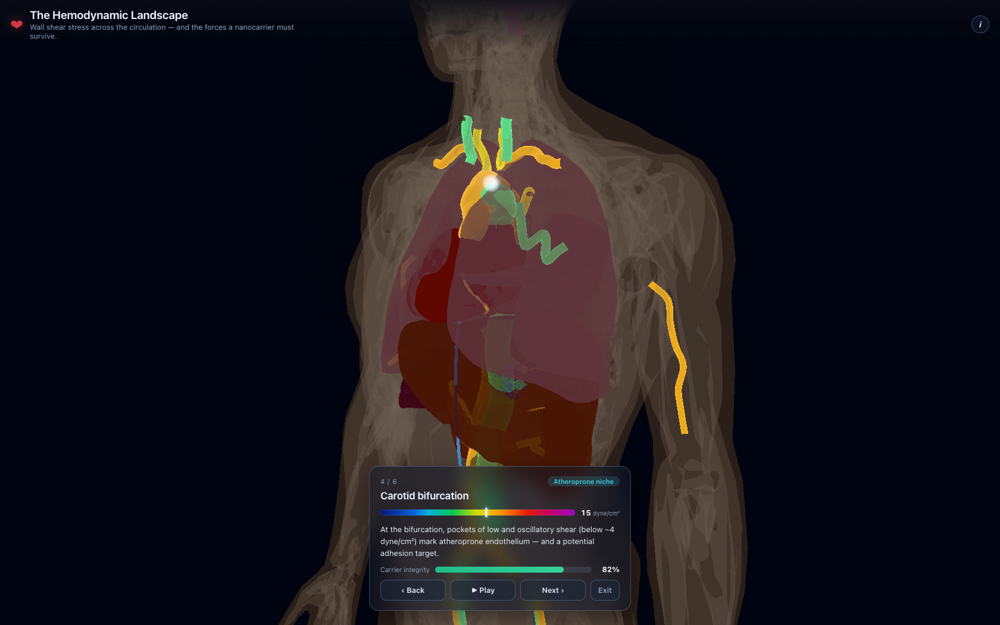
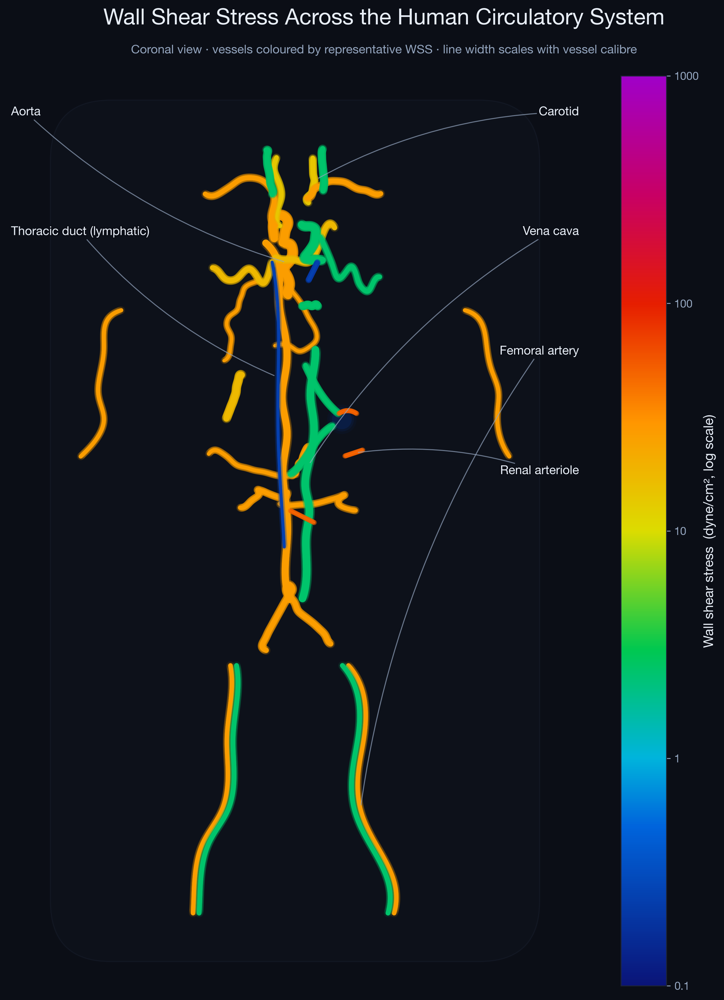
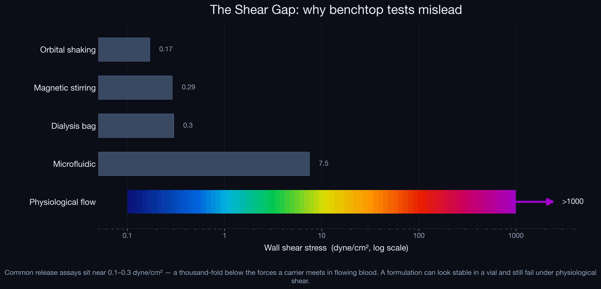
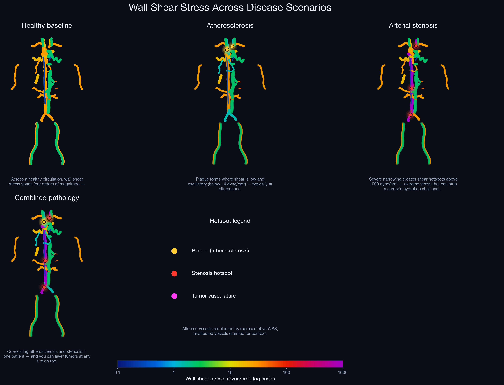
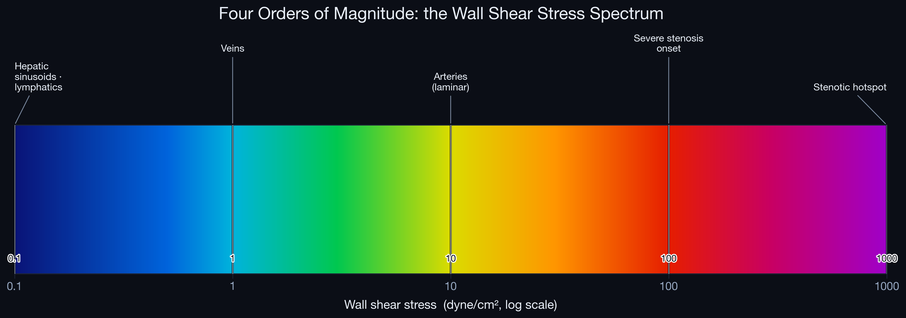

# The Hemodynamic Landscape

[](LICENSE)
[](https://threejs.org)
[](https://harsh9005.github.io/shear-stress-3d-viz/)

> **An interactive 3D map of wall shear stress (WSS) across the human circulatory system — and the mechanical forces a circulating nanocarrier must survive.**

A nanomedicine traveling through the bloodstream meets wall shear stress that spans **four orders of magnitude** — from near-stagnant hepatic sinusoids (~0.1 dyne/cm²) to stenotic hotspots (>1000 dyne/cm²). This project turns that landscape into a living, luminous, explorable visualization.

**▶ [Open the live experience](https://harsh9005.github.io/shear-stress-3d-viz/)**



---

## What it does

The vasculature is rendered as glowing, WSS-colored tubes inside a ghosted human silhouette, with a beating heart and streaming blood-flow particles. Four interactive layers turn the picture into an explanation:

| | |
|---|---|
| **🩸 Scenario explorer** | Switch between a healthy baseline and four pathologies — atherosclerosis, arterial stenosis, tumor vasculature, and a combined worst case. Affected vessels re-color, hotspots ignite, and a grounded explanation updates. |
| **💊 Nanoparticle journey** | Follow a ~100 nm carrier from injection toward its target while a **carrier-integrity gauge** reacts to the real shear forces at each waypoint — margination in low shear, rising membrane permeability, and **burst rupture at the >1000 dyne/cm² stenosis**. |
| **✨ Flow particles** | Particles stream along every vessel at speeds and colors set by the local WSS, so the whole system feels alive. Toggle and density controls included. |
| **📊 Quantitative panels** | A log-scale WSS spectrum, live per-vessel readouts, and **"The Shear Gap"** — the chart that shows why benchtop release assays (~0.1–0.3 dyne/cm²) sit a thousand-fold below physiological flow. |

A colorblind-safe palette, keyboard navigation, reduced-motion support, and a touch/mobile layout are built in.




---

## The wall shear stress landscape

Representative WSS magnitudes consistent with the hemodynamics & nanomedicine literature, spanning four decades:

| Region | WSS (dyne/cm²) | Physiological role |
|:---|:---:|:---|
| Hepatic sinusoids · lymphatics | 0.1 – 0.6 | Near-stagnant; fenestrated endothelium allows nanoparticle access |
| Venous circulation | 1 – 6 | Low-pressure, high-capacitance return |
| Atherosclerosis-prone sites | < 4 | Low / oscillatory shear; upregulates VCAM-1 / ICAM-1 |
| Carotid (laminar) arteries | 10 – 20 | Maintains a quiescent, atheroprotective endothelium |
| General arterial | 10 – 70 | Pulsatile systemic circulation |
| Arterioles | ~ 55 | Highest physiological shear |
| Tumor vasculature | low & oscillatory | Disorganized flow + elevated interstitial pressure impair penetration |
| Stenotic hotspots | > 1000 | Extreme stress; can strip hydration shells and rupture soft lipid bilayers |

All values used by the app and the figures come from a single source of truth, `build/build_data.py` → `docs/data/data.json`, and are checked against an explicit allowlist (`build/test_build_data.py`).

---

## Static figures

Publication-style figures, regenerated from the same data:

| Wall shear stress map | The Shear Gap |
|:---:|:---:|
|  |  |

| Disease scenarios | WSS spectrum |
|:---:|:---:|
|  |  |

---

## Run it locally

The interactive app is a no-build, static Three.js site (modules loaded from a pinned CDN), so it needs to be **served over HTTP** — opening `index.html` directly via `file://` won't load ES modules.

```bash
# Serve the app
cd docs
python3 -m http.server 8000
# then open http://localhost:8000/
```

Regenerate the data and the static figures:

```bash
# Rebuild the single source of truth (docs/data/data.{json,js})
python3 build/build_data.py
python3 -m pytest build/        # 15 invariants incl. schema + honesty checks

# Rebuild the static figures
pip install -r requirements.txt
python3 figures/generate_static_figures.py
```

---

## How it's built

```
docs/                      # GitHub Pages site (the interactive app)
  index.html               #   shell + pinned Three.js import map
  css/style.css            #   dark glassmorphic UI (responsive, reduced-motion)
  js/                      #   main · colorscale · vessels · flow · panels · scenarios · journey · ui
  data/data.{json,js}      #   generated single source of truth
build/
  build_data.py            # the only place geometry + WSS + scenarios + journey live
  allowed_wss.py           # defensible-value allowlist
  test_build_data.py       # schema + honesty invariants
figures/
  generate_static_figures.py  # matplotlib figures from docs/data/data.json
tools/capture.mjs          # headless-Chrome capture (hero stills / GIF)
```

- **Rendering** — `WebGLRenderer` + `UnrealBloomPass` (tuned so the colorscale stays legible), `OrbitControls`, an emissive/Fresnel vessel shader, and arc-length-LUT flow particles.
- **Single source of truth** — `build_data.py` serializes once to `data.json`, then re-emits it as an ES module `data.js`; the web app imports the module and the figures read the JSON, so no number is written twice.
- **Color scale** — a log mapping (0.1 → 1000 dyne/cm²) owned by `colorscale.js`, with a colorblind-safe cividis alternative.

---

## License

MIT — see [LICENSE](LICENSE).

WSS magnitudes shown here are representative values consistent with the published hemodynamics and nanomedicine literature, provided for visualization and education.
