# Wall Shear Stress in the Human Circulatory System

[](LICENSE)
[](https://python.org)
[](https://matplotlib.org)
[](https://plotly.com)

> **Programmatically generated visualizations mapping wall shear stress (WSS) distributions across the human circulatory system under healthy and pathological conditions, based on published hemodynamic data.**

---

## Overview

This visualization accompanies the review article:

> **"Resolving the Biomechanical Blind Spot in Nanomedicine Translation"**
> Modh H, Leong D, Dindhoria K, Malinovskaya J, Pirola S, Wendt B, Wacker MG.
> *ACS Nano*, 2025.

Circulating nanocarriers navigate a complex mechanical landscape where wall shear stress varies by **four orders of magnitude** -- from 0.1 dyne/cm^2 in hepatic sinusoids to over 1000 dyne/cm^2 in stenotic regions. These visualizations allow researchers to explore how different pathologies reshape the hemodynamic forces that nanocarriers encounter.

---

## Scenario Comparison Dashboard

A single overview showing all seven pathological scenarios and how they differ from the healthy baseline:

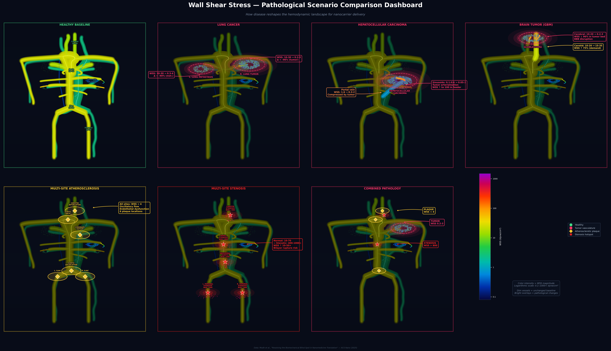

---

## Healthy vs Pathology Comparisons

Each comparison features a **side-by-side layout** (healthy left, pathology right) with a **quantitative WSS bar chart** showing regional changes. Pathological regions are highlighted with bright overlays on a dimmed vascular base, making differences immediately visible.

### Lung Cancer
Tumor vasculature in both lungs creates chaotic, low-WSS regions (0.2--3 dyne/cm^2) with up to 96% WSS reduction in the pulmonary bed.

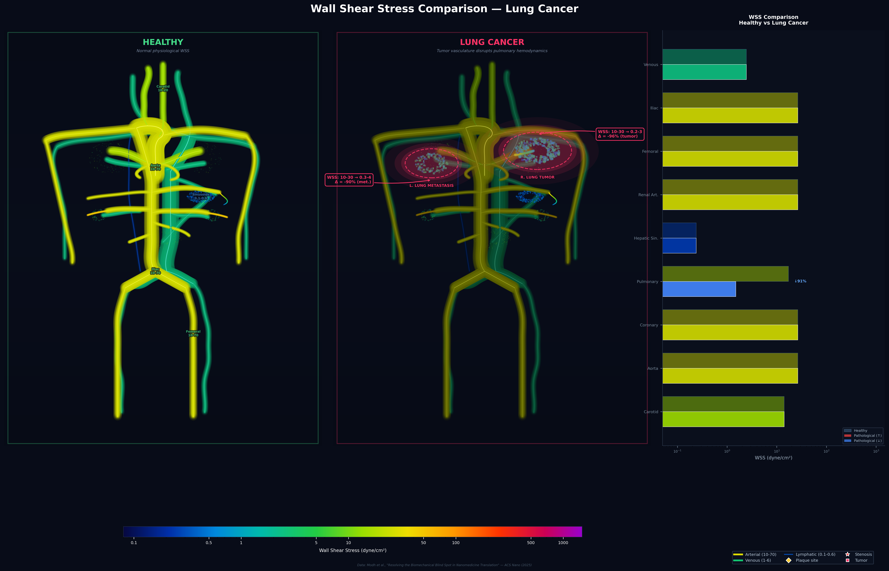

### Hepatocellular Carcinoma (HCC)
HCC arterialization creates aberrant high-WSS feeder arteries (up to 100 dyne/cm^2) while compressing the portal vein and disrupting sinusoidal architecture.

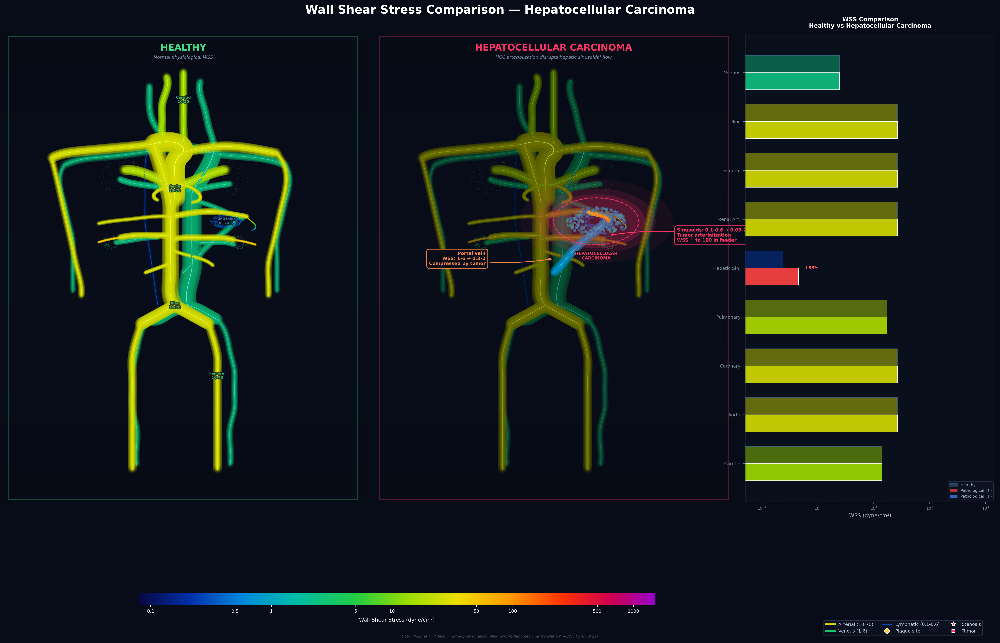

### Brain Tumor (Glioblastoma)
Glioblastoma neovasculature drops cerebral WSS by 96% in the tumor bed while increasing carotid WSS by 75% due to elevated flow demand.

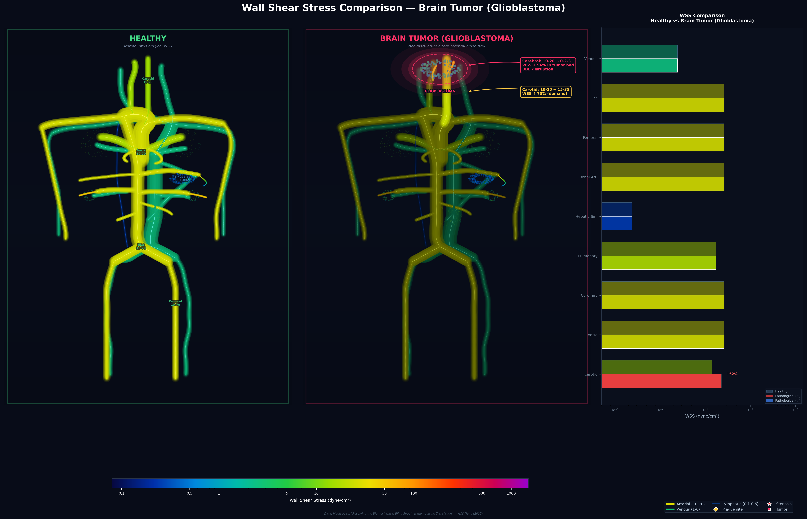

### Multi-Site Atherosclerosis
Plaque accumulation at 6 arterial bifurcations (carotid, aortic arch, coronary, iliac) reduces local WSS below 4 dyne/cm^2 -- promoting endothelial dysfunction.

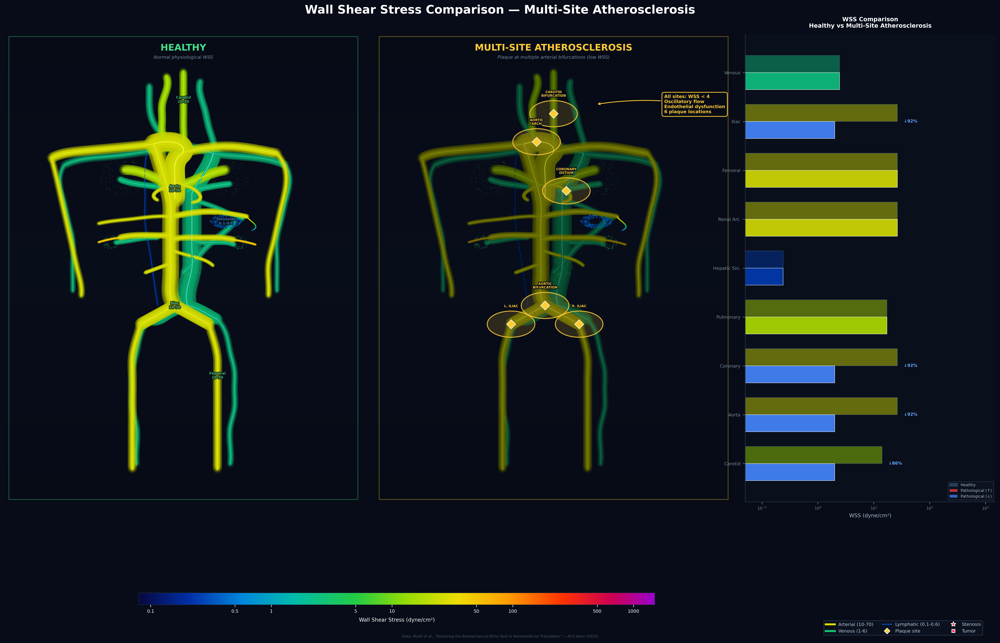

### Multi-Site Arterial Stenosis
Severe narrowing at 5 sites creates extreme WSS hotspots (400--1000+ dyne/cm^2) -- a 10-50x increase that can rupture nanoparticle lipid bilayers.

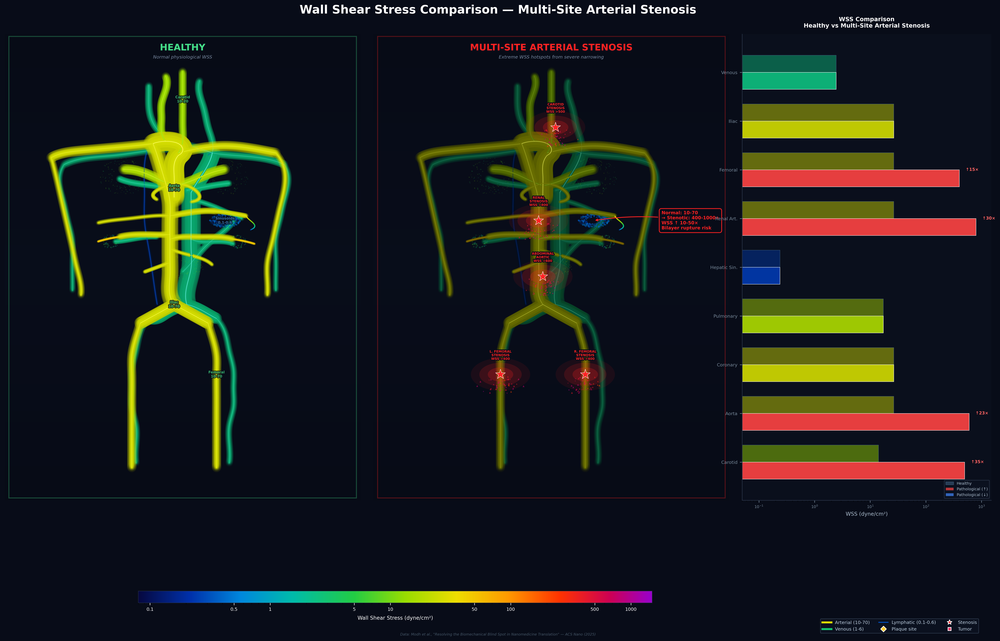

### Combined Severe Pathology
The worst case: co-existing atherosclerosis, stenosis, and lung tumor in a single patient, showing the full range of hemodynamic disruption.

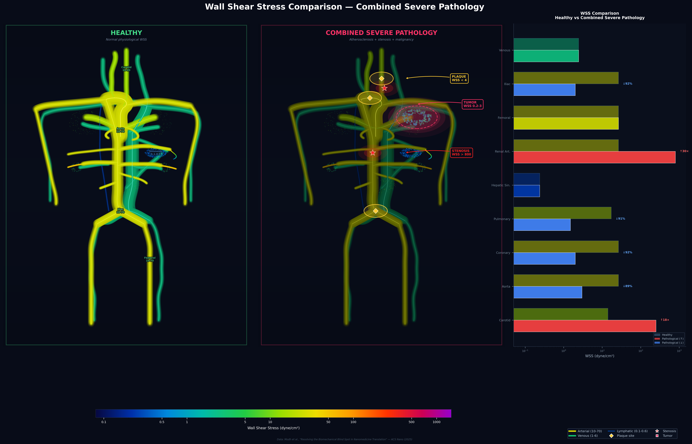

---

## Individual Scenario Figures

Full-resolution standalone figures for each scenario:

| Scenario | Preview |
|:---|:---:|
| Healthy Baseline | 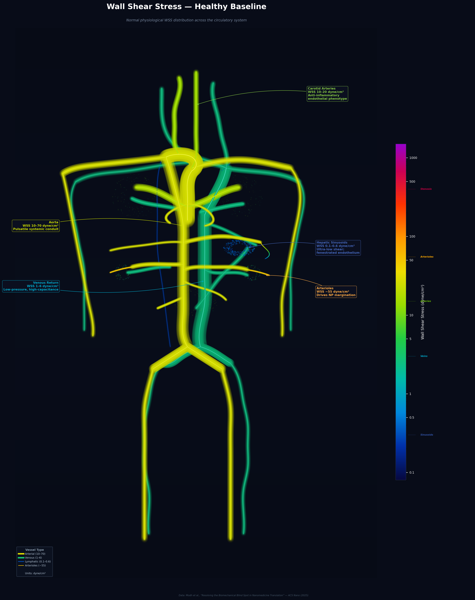 |
| Lung Cancer | 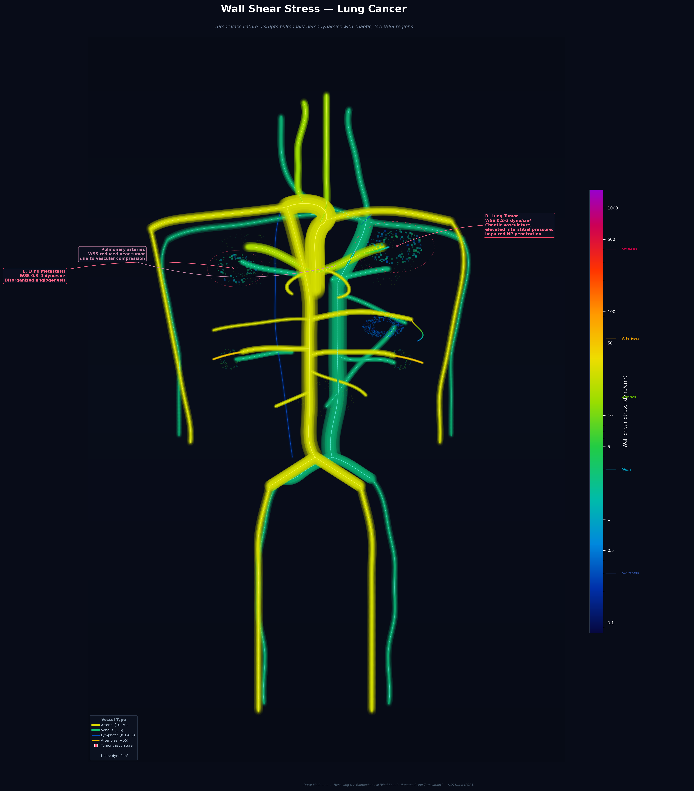 |
| Hepatocellular Carcinoma | 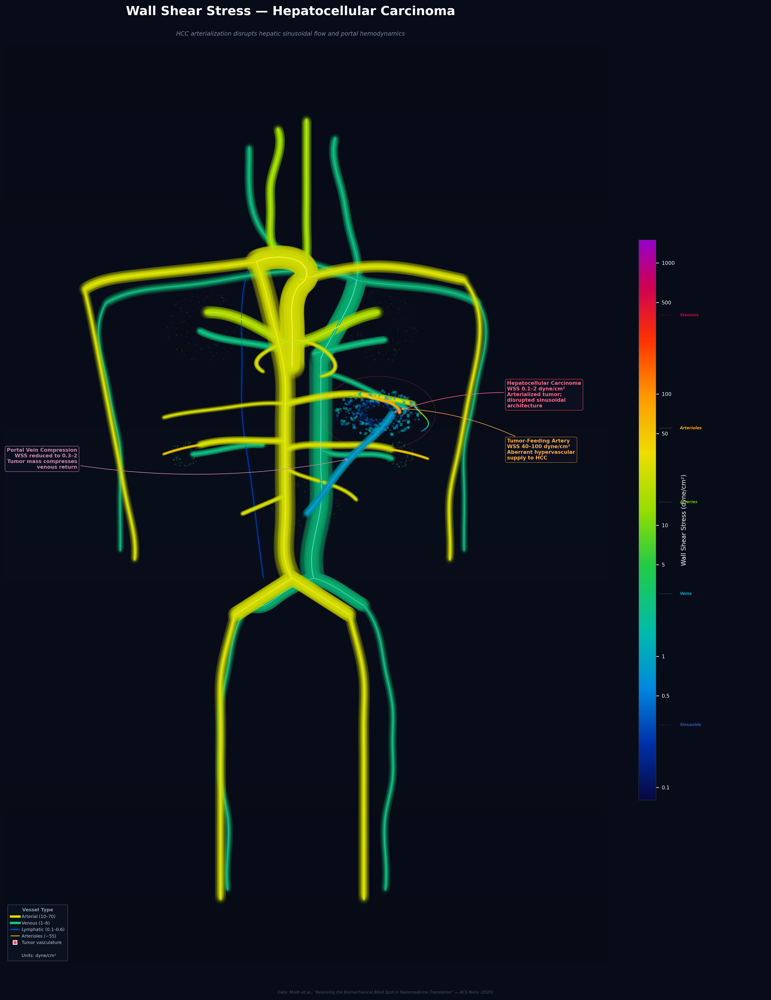 |
| Brain Tumor (GBM) | 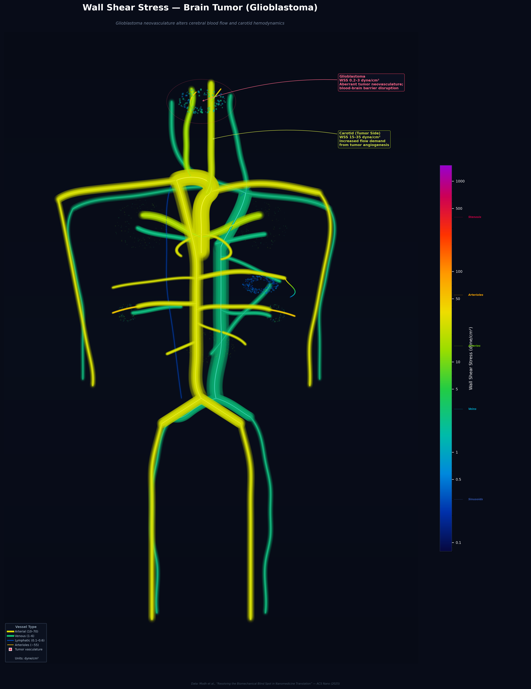 |
| Multi-Site Atherosclerosis | 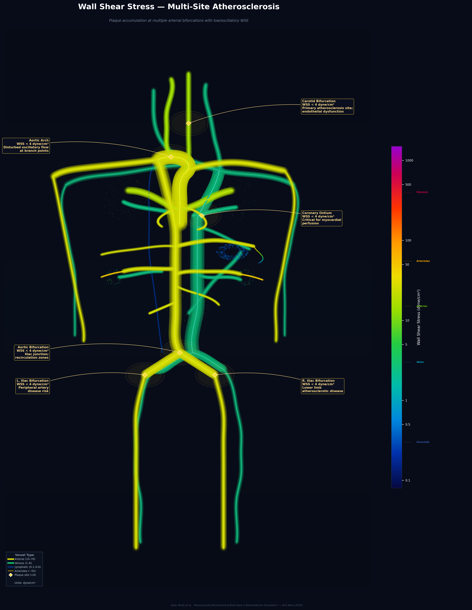 |
| Multi-Site Stenosis | 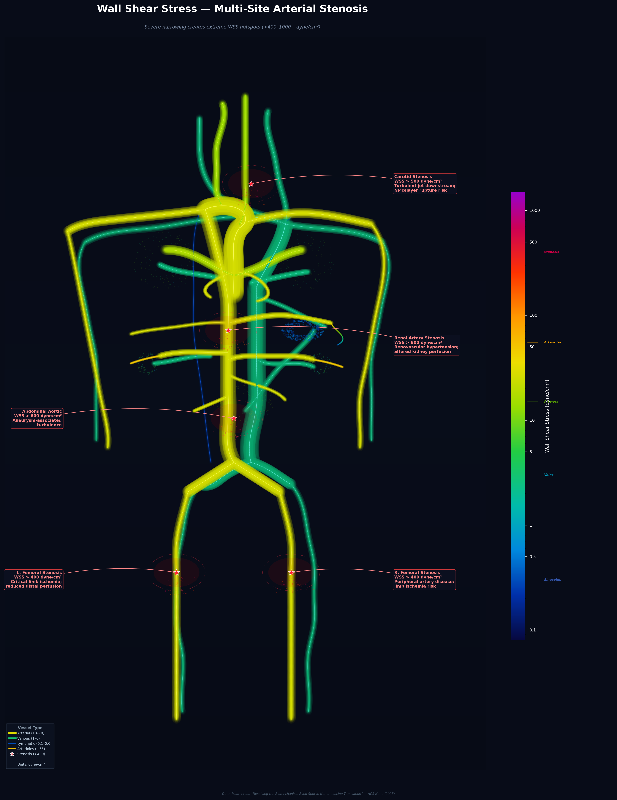 |
| Combined Pathology | 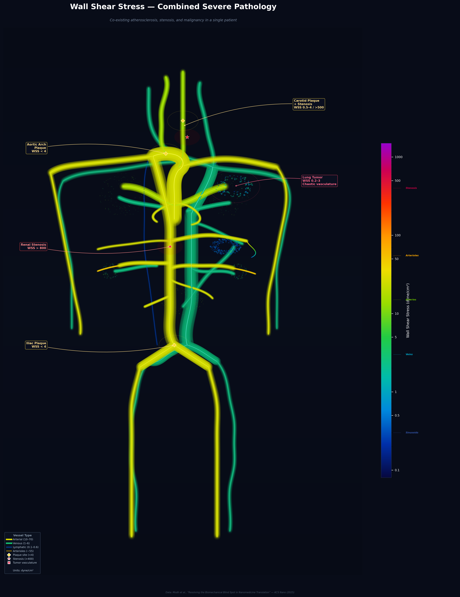 |

---

## Wall Shear Stress Data

All WSS values are sourced from peer-reviewed hemodynamic literature:

| Vascular Region | WSS (dyne/cm^2) | Physiological Significance |
|:---|:---:|:---|
| Hepatic sinusoids | 0.1--0.6 | Ultra-low; fenestrated endothelium enables NP access |
| Lymphatic vessels | 0.1--0.6 | Near-stagnant drainage flow |
| Venous circulation | 1--6 | Low-pressure, high-capacitance return |
| Atherosclerotic sites | <4 | Pathological; promotes plaque formation |
| Carotid arteries | 10--20 | Physiological; maintains endothelial homeostasis |
| Arterioles | ~55 | High shear; drives nanoparticle margination |
| General arterial | 10--70 | Pulsatile systemic circulation |
| Tumor vasculature | 0.2--4 | Chaotic; elevated interstitial pressure |
| Stenotic regions | >100--1000+ | Extreme; ruptures soft lipid bilayers |

---

## Quick Start

### Prerequisites
- Python 3.8+
- pip

### Installation & Generation

```bash
# Clone the repository
git clone https://github.com/your-username/shear-stress-3d-viz.git
cd shear-stress-3d-viz

# Install dependencies
pip install -r requirements.txt

# Generate comparison figures (side-by-side + dashboard)
python generate_comparison.py

# Generate individual scenario figures
python generate_scenarios.py

# Generate a specific scenario
python generate_scenarios.py healthy
python generate_scenarios.py lung_cancer

# Generate the interactive 3D visualization
python generate_viz.py
```

### Available Scenarios

| Key | Scenario | Comparison Output | Scenario Output |
|:---|:---|:---|:---|
| `lung_cancer` | Lung Cancer | `comparisons/compare_lung_cancer.png` | `scenarios/02_lung_cancer.png` |
| `liver_cancer` | Hepatocellular Carcinoma | `comparisons/compare_liver_cancer.png` | `scenarios/03_liver_cancer_hcc.png` |
| `brain_tumor` | Brain Tumor (GBM) | `comparisons/compare_brain_tumor.png` | `scenarios/04_brain_tumor_gbm.png` |
| `atherosclerosis` | Multi-Site Atherosclerosis | `comparisons/compare_atherosclerosis.png` | `scenarios/05_multi_atherosclerosis.png` |
| `stenosis` | Multi-Site Arterial Stenosis | `comparisons/compare_stenosis.png` | `scenarios/06_multi_stenosis.png` |
| `combined` | Combined Severe Pathology | `comparisons/compare_combined.png` | `scenarios/07_combined_pathology.png` |

---

## How It Works

The entire visualization is **programmatically generated** -- no external mesh files, 3D models, or image assets required.

### Comparison Figures (`generate_comparison.py`)

| Component | Method |
|:---|:---|
| Side-by-side layout | Healthy (full brightness) vs Pathology (dimmed base + bright overlays) |
| Pathological highlights | Multi-layer glow rings, bright scatter beds, prominent markers |
| Delta annotations | WSS change callouts with percentage/fold-change labels |
| Bar chart | Log-scale horizontal bars with healthy vs pathological WSS per region |
| Dashboard | 7 thumbnail panels in a 2x4 grid with color-coded borders |

### 2D Scenario Figures (`generate_scenarios.py`)

| Component | Method |
|:---|:---|
| Blood vessels | Cubic spline paths with multi-layer glow rendering for 3D depth effect |
| Glow effect | 4 concentric translucent halos (atmosphere, outer, inner, core) + specular highlight |
| Sinusoidal beds | Stochastic scatter point clouds in ellipsoidal volumes |
| Color mapping | Logarithmic scale: `log10(WSS)` mapped to indigo-cyan-green-yellow-orange-red-purple |
| Pathological markers | Diamond (plaque), star (stenosis), square scatter (tumor vasculature) |
| Depth simulation | Veins rendered darker (depth-fading) to appear behind arteries |

### Interactive 3D Visualization (`generate_viz.py`)

| Component | Method |
|:---|:---|
| Body outline | 14 parametric ellipsoids (torso, head, limbs) at 6% opacity |
| Blood vessels | Tube meshes via Rotation-Minimizing Frames (RMF) around cubic spline paths |
| Export | Plotly HTML with CDN-loaded JavaScript |

---

## Project Structure

```
shear-stress-3d-viz/
├── generate_comparison.py # Comparison figures (side-by-side + dashboard)
├── generate_scenarios.py  # Scenario-based 2D figures (7 scenarios)
├── generate_figure_v2.py  # Base 2D circulatory system figure
├── generate_viz.py        # Interactive 3D Plotly visualization
├── comparisons/           # Generated comparison figures (PNG + PDF)
│   ├── scenario_dashboard.png
│   ├── compare_lung_cancer.png
│   ├── compare_liver_cancer.png
│   ├── compare_brain_tumor.png
│   ├── compare_atherosclerosis.png
│   ├── compare_stenosis.png
│   └── compare_combined.png
├── scenarios/             # Generated individual scenario figures (PNG + PDF)
│   ├── 01_healthy_baseline.png
│   ├── 02_lung_cancer.png
│   ├── 03_liver_cancer_hcc.png
│   ├── 04_brain_tumor_gbm.png
│   ├── 05_multi_atherosclerosis.png
│   ├── 06_multi_stenosis.png
│   └── 07_combined_pathology.png
├── docs/
│   └── index.html         # Interactive 3D visualization (Plotly)
├── requirements.txt       # matplotlib, plotly, numpy, scipy
├── LICENSE                # MIT
└── README.md              # This file
```

---

## Technical Details

### Vessel Rendering Algorithm
Vessels are rendered with a multi-layer glow technique for 3D depth perception:
1. **Cubic spline interpolation** (`scipy.interpolate.splprep/splev`) of anatomical control points
2. **4-layer translucent glow** with decreasing width and increasing opacity
3. **Core vessel** at full opacity with WSS-mapped color
4. **Specular highlight** (thin white center line) simulating light reflection

### Color Scale
The WSS range spans 4 orders of magnitude (0.1--1000+ dyne/cm^2), requiring a logarithmic color mapping:

```
Deep Indigo (0.1) -> Cyan (1) -> Green (3) -> Yellow (10) -> Orange (30) -> Red (100) -> Purple (1000)
```

### Comparison Visualization Design
- **Dimmed base**: In pathology panels, the healthy vasculature is rendered at 50% brightness so pathological overlays stand out
- **Highlight rings**: Multi-layer glow circles (3 concentric rings at decreasing opacity) mark affected regions
- **Delta labels**: Quantitative WSS change annotations (e.g., "WSS: 10-70 -> 400-1000+, 18x increase")
- **Bar chart**: Paired horizontal bars on a log scale with color coding -- red for WSS increase, blue for decrease

---

## Citation

If you use this visualization in your work, please cite:

```bibtex
@article{modh2025biomechanical,
  title={Resolving the Biomechanical Blind Spot in Nanomedicine Translation},
  author={Modh, Harshvardhan and Leong, Dylan and Dindhoria, Kiran and
          Malinovskaya, Julia and Pirola, Selene and Wendt, Bernd and
          Wacker, Matthias Gerhard},
  journal={ACS Nano},
  year={2025},
  publisher={American Chemical Society}
}
```

---

## License

This project is licensed under the MIT License -- see [LICENSE](LICENSE) for details.

---

<p align="center">
  <i>Developed at the National University of Singapore, Department of Pharmacy and Pharmaceutical Sciences</i>
</p>
